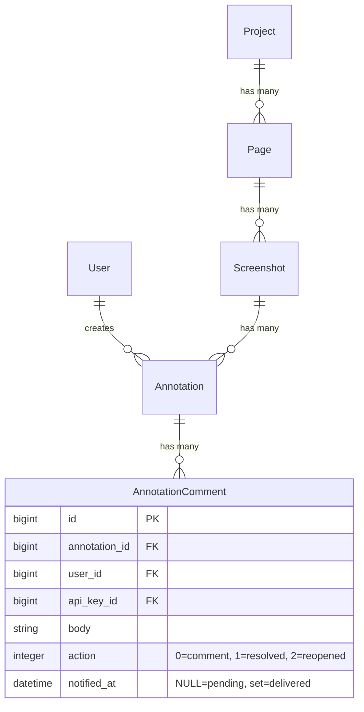

# feat: Answer Feedback with Digest Notifications

## Overview

Currently, when Claude retrieves annotations from Screenote, it can only mark them as "resolved." This plan adds two capabilities:

1. **Answer feedback** — Claude leaves an explanatory reply comment before resolving each annotation, so the reviewer knows what was fixed
2. **Digest notifications** — Annotation authors receive a single hourly email summarizing all resolutions, instead of per-annotation spam

The feature spans two repos:
- **claude-screenote** (this repo) — SKILL.md changes for comment-before-resolve behavior
- **screenote** (the Rails app) — new column, mailer, and background job for digest notifications

## Problem Statement

Reviewers leave visual annotations on screenshots. Claude fixes the issues and marks them resolved, but:
- The reviewer has **no explanation** of what was changed — they must open the code to verify
- The reviewer has **no notification** that their feedback was addressed — they must manually check Screenote

---

## Part 1: Answer Feedback (SKILL.md Change)

### What Changes

Update `skills/feedback/SKILL.md` Step 6 to instruct Claude to always post an explanatory comment before resolving.

### Prior Behavior (Step 6, replaced by this PR)

```markdown
### Step 6: Offer Next Steps
- Address a specific annotation (and mark it resolved via `resolve_annotation` when done)
- Address all annotations one by one
- Take a new screenshot after making fixes
```

### New Behavior (Step 6)

Replace Step 6 with a detailed "Fix and Respond" workflow:

```markdown
### Step 6: Fix and Respond

After presenting annotations, ask the user what to do. Then for each annotation being addressed:

1. **Fix the code** (if a code change is needed)
2. **Post a reply comment** explaining what was done:
   - Call `add_annotation_comment` with `project_id`, `annotation_id`, and a `body` describing the fix
   - Comment format: describe what was changed and where (file:line)
   - For "won't fix" / "by design" cases, explain the reasoning instead
3. **Resolve the annotation**:
   - Call `resolve_annotation` with `project_id`, `annotation_id`, and a brief `comment` (e.g., "Fixed" or "Won't fix — see reply")
4. **Handle failures by error class** — 401/403 stop and re-auth (do not resolve), 422 show and retry, 5xx/network retry once then stop; report `resolve_annotation` failures verbatim

Offer these options:
- Fix a specific annotation (and comment + resolve when done)
- Fix all annotations one by one (comment + resolve each)
- Reply without fixing (leave a comment explaining why, then resolve)
- Take a new screenshot after making fixes (`/screenote <url>`)
```

### Key Design Decisions

**Q: Why call both `add_annotation_comment` AND `resolve_annotation` instead of just using `resolve_annotation`'s `comment` param?**

They serve different purposes:
- `add_annotation_comment` → creates a visible **reply** in the annotation thread (action: `comment`). This is what the reviewer reads.
- `resolve_annotation` `comment` param → creates a **resolution note** (action: `resolved`). This is the audit trail entry.

**Q: What should the comment say?**

Template:
```
Fixed: [one-line summary]
Changed: [file:line] — [what was changed]
```

For non-code resolutions:
```
Won't fix: [reason]
```

**Q: What if the MCP call fails?**

Branch on error class — never blindly proceed:
- 401 / 403 on `add_annotation_comment` → stop, prompt re-auth, do NOT call `resolve_annotation` (resolving with no explanatory comment leaves a silent audit gap and the resolve will likely fail anyway).
- 422 validation → surface the error, adjust body, retry.
- 5xx / network → retry once; if still failing, stop.
- `resolve_annotation` failure → report the error verbatim, do not retry silently.

### Files to Change

| File | Change |
|---|---|
| `skills/feedback/SKILL.md` Step 6 | Replace "Offer Next Steps" with new "Fix and Respond" workflow |

---

## Part 2: Digest Notifications (Screenote Rails App)

### Architecture

No new models. A single `notified_at` column on `annotation_comments` tracks which resolutions have been emailed. A SolidQueue recurring job queries unnotified resolutions and sends digest emails.

```
Annotation resolved (any source: MCP tool OR web UI)
  → AnnotationComment created with action: :resolved
  → notified_at is NULL by default

SolidQueue job (every 60 min, production only)
  → Query: AnnotationComment.where(action: :resolved, notified_at: nil)
  → Filter out self-resolutions (resolver == annotation author)
  → Filter out authors without email
  → Group by annotation author
  → Send one digest email per author
  → UPDATE notified_at for sent comments
```

### Migration

```ruby
# db/migrate/XXXXXX_add_notified_at_to_annotation_comments.rb
class AddNotifiedAtToAnnotationComments < ActiveRecord::Migration[8.1]
  def change
    add_column :annotation_comments, :notified_at, :datetime

    # Mark all existing resolved comments as already notified to prevent retroactive spam
    reversible do |dir|
      dir.up do
        resolved_value = AnnotationComment.actions[:resolved]
        execute "UPDATE annotation_comments SET notified_at = CURRENT_TIMESTAMP WHERE action = #{resolved_value}"
      end
    end
  end
end
```

### Background Job

```ruby
# app/jobs/send_digest_notifications_job.rb
class SendDigestNotificationsJob < ApplicationJob
  queue_as :default

  # Hard SMTP errors worth dropping (invalid recipient, permanent reject).
  # Transient SMTP errors (Net::SMTPServerBusy, Net::ReadTimeout) propagate
  # so SolidQueue can retry — notified_at is still NULL at that point.
  DROP_ERRORS = [
    Net::SMTPFatalError,
    Net::SMTPSyntaxError,
    Net::SMTPAuthenticationError
  ].freeze

  # After this many consecutive send_digest failures in a single run, re-raise
  # so the job fails loudly instead of silently dropping every hour's digests
  # (e.g. mailer template regression, ENV misconfig).
  CIRCUIT_THRESHOLD = 3

  def perform
    consecutive_failures = 0

    unnotified_resolutions
      .group_by { |c| c.annotation.user }
      .each do |author, comments|
        next if author.nil? || author.email.blank?

        # Filter out self-resolutions
        # ApiKey belongs_to :project (no user association), so API resolutions
        # cannot be identified as self-review — they always notify.
        non_self = comments.reject { |c| c.user.present? && c.user == author }
        next if non_self.empty?

        begin
          send_digest(author, non_self)
          consecutive_failures = 0
        rescue *DROP_ERRORS => e
          report_drop(author, non_self, e)
          consecutive_failures += 1
          raise if consecutive_failures >= CIRCUIT_THRESHOLD
        end
      end

    sweep_orphaned_resolutions
  end

  private

  def unnotified_resolutions
    AnnotationComment
      .where(action: :resolved, notified_at: nil)
      .includes(:user, annotation: [:user, { screenshot: { page: :project } }])
  end

  # Mark notifications for resolutions whose annotation author was deleted
  # or has no email. Without this, they stay notified_at: nil forever and
  # are re-queried on every run.
  def sweep_orphaned_resolutions
    orphan_ids = AnnotationComment
      .where(action: :resolved, notified_at: nil)
      .joins("LEFT JOIN annotations ON annotations.id = annotation_comments.annotation_id")
      .joins("LEFT JOIN users ON users.id = annotations.user_id")
      .where("users.id IS NULL OR users.email IS NULL OR users.email = ''")
      .pluck(:id)

    AnnotationComment.where(id: orphan_ids).update_all(notified_at: Time.current) if orphan_ids.any?
  end

  def send_digest(recipient, comments)
    # Mark as notified BEFORE sending to guarantee at-most-once delivery on
    # hard failures. Transient errors (SMTP busy, timeouts) propagate so
    # SolidQueue retries; hard DROP_ERRORS are caught in #perform and reported
    # to the exception tracker. Resolutions remain visible in the UI either way.
    comment_ids = comments.map(&:id)
    AnnotationComment.where(id: comment_ids).update_all(notified_at: Time.current)
    NotificationMailer.resolution_digest(recipient, comments).deliver_now
  rescue *DROP_ERRORS
    raise # let #perform report and apply the circuit breaker
  rescue => e
    # Non-SMTP error after the mark succeeded (e.g. template bug). Re-raise so
    # SolidQueue records the job failure AND the exception tracker catches it.
    # notified_at stays set — we accept the drop for this batch to avoid dupes.
    Rails.error.report(e, context: { recipient_id: recipient.id, comment_ids: comment_ids })
    raise
  end

  def report_drop(recipient, comments, error)
    Rails.error.report(error, context: {
      recipient_id: recipient.id,
      comment_ids: comments.map(&:id),
      reason: "hard SMTP failure — digest dropped"
    })
  end
end
```

### SolidQueue Recurring Schedule

Add under existing `production:` key in `config/recurring.yml`:

```yaml
production:
  clear_solid_queue_finished_jobs:
    command: "SolidQueue::Job.clear_finished_in_batches(sleep_between_batches: 0.3)"
    schedule: every hour at minute 12

  send_digest_notifications:
    class: SendDigestNotificationsJob
    schedule: every hour at minute 0
```

### Mailer

```ruby
# app/mailers/notification_mailer.rb
class NotificationMailer < ApplicationMailer
  def resolution_digest(recipient, comments)
    @recipient = recipient
    @grouped = prepare_grouped_comments(comments)

    mail(
      to: recipient.email,
      subject: subject_line(comments)
    )
  end

  private

  def subject_line(comments)
    count = comments.size
    projects = comments.map { |c| c.annotation.screenshot.page.project.name }.uniq
    project_label = projects.size == 1 ? projects.first : "#{projects.size} projects"
    "[Screenote] #{count} annotation#{'s' if count > 1} resolved in #{project_label}"
  end

  def prepare_grouped_comments(comments)
    latest_replies = latest_reply_by_annotation(comments)

    comments.group_by { |c| c.annotation.screenshot }.map do |screenshot, screenshot_comments|
      {
        page_name: screenshot.page.name,
        screenshot_title: screenshot.title,
        items: screenshot_comments.map { |c| build_item(c, latest_replies[c.annotation_id]) }
      }
    end
  end

  # Single query: for each annotation in the batch, find the most recent reply
  # comment posted at or before the resolution's created_at. Avoids N+1 in
  # #build_item.
  def latest_reply_by_annotation(comments)
    resolution_times = comments.index_by(&:annotation_id).transform_values(&:created_at)
    annotation_ids = resolution_times.keys

    replies = AnnotationComment
      .where(annotation_id: annotation_ids, action: :comment)
      .order(annotation_id: :asc, created_at: :desc)

    replies.each_with_object({}) do |reply, acc|
      next if acc[reply.annotation_id] # already kept the newest
      next if reply.created_at > resolution_times[reply.annotation_id]
      acc[reply.annotation_id] = reply
    end
  end

  def build_item(resolution_comment, reply)
    {
      annotation_text: resolution_comment.annotation.comment,
      reply_text: reply&.body,
      resolver: resolution_comment.user&.email || "API"
    }
  end
end
```

### Email Template

```erb
<%# app/views/notification_mailer/resolution_digest.html.erb %>

<h2>Feedback resolved in your project</h2>

<p>Hi <%= @recipient.email %>,</p>

<% @grouped.each do |group| %>
  <h3><%= group[:page_name] %> — <%= group[:screenshot_title] %></h3>

  <% group[:items].each do |item| %>
    <table cellpadding="0" cellspacing="0" border="0" width="100%">
      <tr>
        <td width="3" bgcolor="#4A90D9"></td>
        <td style="padding-left: 12px; padding-bottom: 16px;">
          <p><strong>Your annotation:</strong> <%= truncate(item[:annotation_text], length: 200) %></p>
          <% if item[:reply_text] %>
            <p><strong>Reply:</strong> <%= truncate(item[:reply_text], length: 500) %></p>
          <% end %>
          <p><strong>Resolved by:</strong> <%= item[:resolver] %></p>
        </td>
      </tr>
    </table>
  <% end %>
<% end %>

<p>
  <a href="<%= root_url %>">View in Screenote</a>
</p>
```

Note: Email templates require inline styles for cross-client compatibility (intentional exception to the project's "no inline styles" rule). Using table-based layout for maximum email client support.

### Files to Create/Change (Screenote Rails App)

| File | Action | Description |
|---|---|---|
| `db/migrate/XXXXXX_add_notified_at_to_annotation_comments.rb` | Create | Add column + backfill existing |
| `app/jobs/send_digest_notifications_job.rb` | Create | Hourly job to send digest emails |
| `config/recurring.yml` | Edit | Add job under `production:` key |
| `app/mailers/notification_mailer.rb` | Create | Digest mailer with data preparation |
| `app/views/notification_mailer/resolution_digest.html.erb` | Create | Email template (render only, no queries) |
| `test/jobs/send_digest_notifications_job_test.rb` | Create | Job tests |
| `test/mailers/notification_mailer_test.rb` | Create | Mailer tests |

---

## Edge Cases Handled

| Case | Behavior |
|---|---|
| Self-review (resolver == annotation author) | Filtered out in job, no email |
| API key resolution (no user on ApiKey) | Cannot determine resolver identity — always notifies |
| Author has no email or was deleted | `sweep_orphaned_resolutions` marks them notified so they aren't re-queried forever |
| Transient SMTP error (busy, timeout) | Propagates out of `send_digest`; SolidQueue retries with `notified_at` still NULL |
| Hard SMTP error (fatal, auth, syntax) | Caught and reported; digest dropped (at-most-once) |
| Non-SMTP error after marking notified (template bug, etc.) | Reported to exception tracker; job re-raises; batch is dropped to avoid dupes |
| >=3 consecutive `send_digest` failures in one run | Circuit breaker re-raises so the job fails loudly (catches systemic regressions) |
| First deploy with existing data | Migration backfills `notified_at` on all existing resolved comments |
| Manual resolution via web UI | Same `AnnotationComment` with `action: resolved` is created, job picks it up |
| Multiple authors on same screenshot | Each author gets their own digest |
| Zero resolutions in an hour | Job runs, finds nothing, exits cleanly |
| Comments span multiple projects | Subject line shows project count |

---

## Acceptance Criteria

### Part 1: Answer Feedback
- [ ] Claude posts a reply comment (via `add_annotation_comment`) before resolving any annotation
- [ ] Both MCP calls pass `project_id` alongside `annotation_id`
- [ ] Reply comment describes what was changed (file, line, summary) or why it won't be fixed
- [ ] `resolve_annotation` is called after the comment is posted — except on 401/403 from the comment call, where Claude stops and prompts re-auth
- [ ] "Reply without fixing" option available for won't-fix cases

### Part 2: Digest Notifications
- [ ] `notified_at` column added to `annotation_comments`
- [ ] `SendDigestNotificationsJob` runs every 60 minutes via SolidQueue (production only)
- [ ] Job groups unnotified resolved comments by annotation author
- [ ] Self-resolutions (resolver == author) are filtered out (API-key resolutions always notify)
- [ ] One digest email per author per run
- [ ] Email lists resolved annotations grouped by screenshot/page
- [ ] Email includes the reviewer's original annotation text and Claude's reply
- [ ] No N+1 in mailer: latest-reply lookup is a single query keyed by `annotation_id`
- [ ] `notified_at` set before `deliver_now` to guarantee at-most-once delivery on hard failures
- [ ] Transient SMTP errors propagate to SolidQueue retries (notified_at still NULL)
- [ ] Hard SMTP errors and post-mark failures are reported to the exception tracker (not just `Rails.logger`)
- [ ] Circuit breaker re-raises after 3 consecutive `send_digest` failures in one run
- [ ] Orphaned resolutions (deleted user / no email) are swept so they don't re-queue forever
- [ ] First deploy does not spam existing users (migration backfills `notified_at`)
- [ ] No queries in email template — all data prepared in mailer

---

## ERD



---

## Implementation Order

1. **SKILL.md update** (this repo) — no dependencies, can ship immediately
2. **Migration** (screenote) — add `notified_at` column + backfill
3. **Mailer + template** (screenote) — the email itself
4. **Background job + schedule** (screenote) — starts delivering
5. **Tests** (screenote) — job and mailer tests
