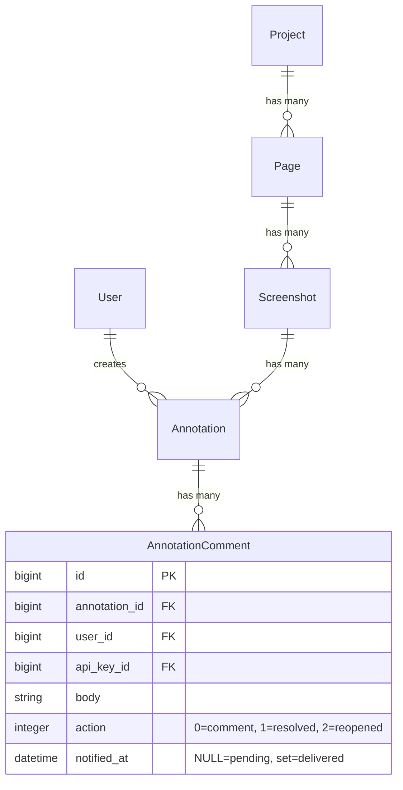

# feat: Answer Feedback with Digest Notifications

## Overview

Currently, when Claude retrieves annotations from Screenote, it can only mark them as "resolved." This plan adds two capabilities:

1. **Answer feedback** — Claude leaves an explanatory reply comment before resolving each annotation, so the reviewer knows what was fixed
2. **Digest notifications** — Annotation authors receive a single hourly email summarizing all resolutions, instead of per-annotation spam

The feature spans two repos:
- **claude-screenote** (this repo) — SKILL.md changes for comment-before-resolve behavior
- **screenote** (the Rails app) — new column, mailer, and background job for digest notifications

## Problem Statement

Reviewers leave visual annotations on screenshots. Claude fixes the issues and marks them resolved, but:
- The reviewer has **no explanation** of what was changed — they must open the code to verify
- The reviewer has **no notification** that their feedback was addressed — they must manually check Screenote

---

## Part 1: Answer Feedback (SKILL.md Change)

### What Changes

Update `skills/feedback/SKILL.md` Step 6 to instruct Claude to always post an explanatory comment before resolving.

### Prior Behavior (Step 6, replaced by this PR)

```markdown
### Step 6: Offer Next Steps
- Address a specific annotation (and mark it resolved via `resolve_annotation` when done)
- Address all annotations one by one
- Take a new screenshot after making fixes
```

### New Behavior (Step 6)

Replace Step 6 with a detailed "Fix and Respond" workflow:

```markdown
### Step 6: Fix and Respond

After presenting annotations, ask the user what to do. Then for each annotation being addressed:

1. **Fix the code** (if a code change is needed)
2. **Post a reply comment** explaining what was done:
   - Call `add_annotation_comment` with `project_id`, `annotation_id`, and a `body` describing the fix
   - Comment format: describe what was changed and where (file:line)
   - For "won't fix" / "by design" cases, explain the reasoning instead
3. **Resolve the annotation**:
   - Call `resolve_annotation` with `project_id`, `annotation_id`, and a brief `comment` (e.g., "Fixed" or "Won't fix — see reply")
4. **Handle failures by error class** — 401/403 stop and re-auth (do not resolve), 422 show and retry, 5xx/network retry once then stop; report `resolve_annotation` failures verbatim

Offer these options:
- Fix a specific annotation (and comment + resolve when done)
- Fix all annotations one by one (comment + resolve each)
- Reply without fixing (leave a comment explaining why, then resolve)
- Take a new screenshot after making fixes (`/screenote <url>`)
```

### Key Design Decisions

**Q: Why call both `add_annotation_comment` AND `resolve_annotation` instead of just using `resolve_annotation`'s `comment` param?**

They serve different purposes:
- `add_annotation_comment` → creates a visible **reply** in the annotation thread (action: `comment`). This is what the reviewer reads.
- `resolve_annotation` `comment` param → creates a **resolution note** (action: `resolved`). This is the audit trail entry.

**Q: What should the comment say?**

Template:
```
Fixed: [one-line summary]
Changed: [file:line] — [what was changed]
```

For non-code resolutions:
```
Won't fix: [reason]
```

**Q: What if the MCP call fails?**

Branch on error class — never blindly proceed:
- 401 / 403 on `add_annotation_comment` → stop, prompt re-auth, do NOT call `resolve_annotation` (resolving with no explanatory comment leaves a silent audit gap and the resolve will likely fail anyway).
- 422 validation → surface the error, adjust body, retry.
- 5xx / network → retry once; if still failing, stop.
- `resolve_annotation` failure → report the error verbatim, do not retry silently.

### Files to Change

| File | Change |
|---|---|
| `skills/feedback/SKILL.md` Step 6 | Replace "Offer Next Steps" with new "Fix and Respond" workflow |

---

## Part 2: Digest Notifications (Screenote Rails App)

### Architecture

No new models. A single `notified_at` column on `annotation_comments` tracks which resolutions have been emailed. A SolidQueue recurring job queries unnotified resolutions and sends digest emails.

```
Annotation resolved (any source: MCP tool OR web UI)
  → AnnotationComment created with action: :resolved
  → notified_at is NULL by default

SolidQueue job (every 60 min, production only, retry_on transient errors)
  → Query: AnnotationComment.where(action: :resolved, notified_at: nil)
           .where.associated(:annotation).limit(1000)
  → Filter out authors without email
  → Group by annotation author
  → Filter out self-resolutions (resolver == annotation author)
  → Per author (with rescue + circuit breaker):
      → deliver_now the digest email
      → UPDATE notified_at (chunked in 500s) on success
  → ensure: sweep_orphaned_resolutions
```

Delivery is **at-least-once**: if a crash or DB failure lands between a successful `deliver_now` and the follow-up `update_all`, the retry will send one duplicate. This is an intentional trade-off — dropping a digest on a transient error is a worse user experience than the rare duplicate.

### Migration

```ruby
# db/migrate/XXXXXX_add_notified_at_to_annotation_comments.rb
class AddNotifiedAtToAnnotationComments < ActiveRecord::Migration[8.1]
  def up
    add_column :annotation_comments, :notified_at, :datetime

    # Mark all existing resolved comments as already notified to prevent
    # retroactive spam on first deploy. Action enum: 0=comment, 1=resolved,
    # 2=reopened. Hard-coded intentionally — migrations must be self-contained
    # and independent of the current AR model definition.
    execute "UPDATE annotation_comments SET notified_at = CURRENT_TIMESTAMP WHERE action = 1"
  end

  def down
    remove_column :annotation_comments, :notified_at
  end
end
```

### Background Job

```ruby
# app/jobs/send_digest_notifications_job.rb
class SendDigestNotificationsJob < ApplicationJob
  queue_as :default

  # Transient failures get a fresh job run via retry_on. SolidQueue backs off
  # polynomially so a flapping provider doesn't hammer us. The narrow allowlist
  # is intentional — non-transient errors (template bugs, auth misconfig) must
  # fail loudly on the first attempt.
  TRANSIENT_ERRORS = [Net::ReadTimeout, Net::SMTPServerBusy, Errno::ECONNRESET].freeze

  retry_on(*TRANSIENT_ERRORS, wait: :polynomially_longer, attempts: 5)
  discard_on ActiveJob::DeserializationError

  # Per-run cap. Prevents memory blow-up on backlog recovery (missed runs)
  # and keeps update_all IN-clauses below typical DB bind-parameter limits.
  # A run that hits the cap leaves older resolutions for the next tick.
  PER_RUN_LIMIT = 1000

  # After this many consecutive send_digest failures in a single run, re-raise
  # so the job fails loudly. Catches systemic regressions (template bug, ENV
  # misconfig) where every author would otherwise be dropped one by one.
  CIRCUIT_THRESHOLD = 3

  def perform
    consecutive_failures = 0

    unnotified_resolutions
      .group_by { |c| c.annotation.user }
      .each do |author, comments|
        next if author.nil? || author.email.blank?

        # ApiKey belongs_to :project (no user association), so API resolutions
        # have c.user_id == nil and fall into non_self (they always notify).
        self_comments, non_self = comments.partition { |c| c.user_id == author.id }

        # Mark self-resolutions as notified even though no email goes out — the
        # author already knows (they resolved their own annotation). Without
        # this, self-resolved rows stay notified_at: nil forever and eventually
        # consume PER_RUN_LIMIT on every subsequent run.
        mark_notified(self_comments.map(&:id)) if self_comments.any?

        next if non_self.empty?

        begin
          send_digest(author, non_self)
          consecutive_failures = 0
        rescue *TRANSIENT_ERRORS
          # Transient network/SMTP errors re-raise out of per-author isolation
          # so retry_on fires and the whole job is rescheduled. Catching them
          # here would defeat retry_on — the rows already marked (author A's
          # successful batch) stay marked on retry, and the failing author's
          # rows stay notified_at: nil for the next attempt.
          raise
        rescue => e
          # Per-author failure isolation for non-transient errors. One bad
          # author (malformed email, unexpected data, template crash) must
          # not abort the run. Report, bump the counter, continue.
          Rails.error.report(e, context: { recipient_id: author.id })
          consecutive_failures += 1
          raise if consecutive_failures >= CIRCUIT_THRESHOLD
        end
      end
  ensure
    # Runs even on circuit-breaker re-raise so orphan rows never persist
    # across runs inflating the query.
    sweep_orphaned_resolutions
  end

  private

  def unnotified_resolutions
    AnnotationComment
      .where(action: :resolved, notified_at: nil)
      .where.associated(:annotation) # INNER JOIN drops orphaned annotation_id rows
      .includes(:user, annotation: [:user, { screenshot: { page: :project } }])
      .limit(PER_RUN_LIMIT)
  end

  # Mark notifications for resolutions whose annotation author was deleted
  # or has no email. Without this, they stay notified_at: nil forever and
  # are re-queried on every run.
  def sweep_orphaned_resolutions
    orphan_ids = AnnotationComment
      .where(action: :resolved, notified_at: nil)
      .joins("LEFT JOIN annotations ON annotations.id = annotation_comments.annotation_id")
      .joins("LEFT JOIN users ON users.id = annotations.user_id")
      .where("users.id IS NULL OR users.email IS NULL OR users.email = ''")
      .pluck(:id)

    mark_notified(orphan_ids)
  end

  def send_digest(recipient, comments)
    # Deliver first, then mark notified on success. This is at-least-once:
    # a SIGKILL or DB failure between successful deliver_now and the
    # update_all can cause one duplicate email on retry. We prefer rare
    # duplicates over silent drops — transient SMTP errors now reliably
    # retry with notified_at still NULL.
    NotificationMailer.resolution_digest(recipient, comments).deliver_now
    mark_notified(comments.map(&:id))
  end

  # Chunked so large backlogs never approach DB bind-parameter limits.
  def mark_notified(comment_ids)
    return if comment_ids.empty?

    comment_ids.each_slice(500) do |slice|
      AnnotationComment.where(id: slice).update_all(notified_at: Time.current)
    end
  end
end
```

### SolidQueue Recurring Schedule

Add under existing `production:` key in `config/recurring.yml`:

```yaml
production:
  clear_solid_queue_finished_jobs:
    command: "SolidQueue::Job.clear_finished_in_batches(sleep_between_batches: 0.3)"
    schedule: every hour at minute 12

  send_digest_notifications:
    class: SendDigestNotificationsJob
    schedule: every hour at minute 0
```

### SMTP Configuration

Set explicit SMTP timeouts in production so a hung connection cannot stall the hourly run:

```ruby
# config/environments/production.rb
config.action_mailer.smtp_settings.merge!(
  open_timeout: 10,  # seconds to wait for connection
  read_timeout: 20   # seconds to wait for server response
)
```

Worst-case wall-clock per run is `PER_RUN_LIMIT * read_timeout = 1000 * 20s ≈ 5.5h` if every delivery hangs — in practice SolidQueue's retry discipline and the circuit breaker (3 consecutive failures → re-raise) bound the damage long before that. A run that exceeds the 60-minute schedule will overlap with the next tick; both invocations query `notified_at: nil` and could race on the same rows. Accept the rare duplicate (at-least-once semantics) or add an advisory lock around `#perform` at implementation time.

### Mailer

```ruby
# app/mailers/notification_mailer.rb
class NotificationMailer < ApplicationMailer
  def resolution_digest(recipient, comments)
    @recipient = recipient
    @grouped = prepare_grouped_comments(comments)

    mail(
      to: recipient.email,
      subject: subject_line(comments)
    )
  end

  private

  def subject_line(comments)
    count = comments.size
    projects = comments.map { |c| c.annotation.screenshot.page.project.name }.uniq
    project_label = projects.size == 1 ? projects.first : "#{projects.size} projects"
    "[Screenote] #{count} annotation#{'s' if count > 1} resolved in #{project_label}"
  end

  def prepare_grouped_comments(comments)
    latest_replies = latest_reply_per_resolution(comments)

    comments.group_by { |c| c.annotation.screenshot }.map do |screenshot, screenshot_comments|
      {
        page_name: screenshot.page.name,
        screenshot_title: screenshot.title,
        items: screenshot_comments.map { |c| build_item(c, latest_replies[c.id]) }
      }
    end
  end

  # For each resolution in the batch, find its annotation's most recent reply
  # posted at or before the resolution's created_at. Keyed by the resolution's
  # own id (not annotation_id) so reopen-resolve-reopen-resolve flows with
  # multiple unnotified resolutions per annotation each get the correct reply.
  # One query fetches every relevant reply; the per-resolution match runs in
  # Ruby to keep the SQL simple.
  def latest_reply_per_resolution(resolutions)
    annotation_ids = resolutions.map(&:annotation_id).uniq

    replies_by_annotation = AnnotationComment
      .where(annotation_id: annotation_ids, action: :comment)
      .order(annotation_id: :asc, created_at: :desc)
      .group_by(&:annotation_id)

    resolutions.each_with_object({}) do |resolution, acc|
      candidates = replies_by_annotation[resolution.annotation_id] || []
      acc[resolution.id] = candidates.find { |r| r.created_at <= resolution.created_at }
    end
  end

  def build_item(resolution_comment, reply)
    {
      annotation_text: resolution_comment.annotation.comment,
      reply_text: reply&.body,
      resolver: resolution_comment.user&.email || "API"
    }
  end
end
```

### Email Template

```erb
<%# app/views/notification_mailer/resolution_digest.html.erb %>

<h2>Feedback resolved in your project</h2>

<p>Hi <%= @recipient.email %>,</p>

<% @grouped.each do |group| %>
  <h3><%= group[:page_name] %> — <%= group[:screenshot_title] %></h3>

  <% group[:items].each do |item| %>
    <table cellpadding="0" cellspacing="0" border="0" width="100%">
      <tr>
        <td width="3" bgcolor="#4A90D9"></td>
        <td style="padding-left: 12px; padding-bottom: 16px;">
          <p><strong>Your annotation:</strong> <%= truncate(item[:annotation_text], length: 200) %></p>
          <% if item[:reply_text] %>
            <p><strong>Reply:</strong> <%= truncate(item[:reply_text], length: 500) %></p>
          <% end %>
          <p><strong>Resolved by:</strong> <%= item[:resolver] %></p>
        </td>
      </tr>
    </table>
  <% end %>
<% end %>

<p>
  <a href="<%= root_url %>">View in Screenote</a>
</p>
```

Note: Email templates require inline styles for cross-client compatibility (intentional exception to the project's "no inline styles" rule). Using table-based layout for maximum email client support.

### Files to Create/Change (Screenote Rails App)

| File | Action | Description |
|---|---|---|
| `db/migrate/XXXXXX_add_notified_at_to_annotation_comments.rb` | Create | Add column + backfill existing |
| `app/jobs/send_digest_notifications_job.rb` | Create | Hourly job to send digest emails |
| `config/recurring.yml` | Edit | Add job under `production:` key |
| `app/mailers/notification_mailer.rb` | Create | Digest mailer with data preparation |
| `app/views/notification_mailer/resolution_digest.html.erb` | Create | Email template (render only, no queries) |
| `test/jobs/send_digest_notifications_job_test.rb` | Create | Job tests (see Required Test Cases below) |
| `test/mailers/notification_mailer_test.rb` | Create | Mailer tests (see Required Test Cases below) |
| `test/system/digest_notifications_test.rb` | Create | End-to-end delivery test using Rails' test mail delivery |

---

## Required Test Cases

The plan's correctness relies on non-obvious invariants (at-least-once delivery, circuit-breaker semantics, orphan handling, reopen flows). The implementation PR must include each test below — the list is exhaustive, not suggestive. Happy-path-only coverage is not sufficient.

### `test/jobs/send_digest_notifications_job_test.rb`

**At-least-once delivery invariant**
- `deliver_now runs before update_all`: stub `deliver_now` to raise; assert `notified_at` is still NULL for all batch rows after `perform` returns.
- `update_all sets notified_at only after successful delivery`: stub `deliver_now` to record the `notified_at` values observed during the mail build; assert they were all NULL at send time.
- `Crash between deliver_now and update_all causes one duplicate on retry`: send successfully, force `update_all` to raise, assert next `perform` re-sends the same digest. (Documents the accepted trade-off.)

**Transient-error retry contract**
- `Net::ReadTimeout during deliver_now leaves notified_at NULL and propagates`: assert rescue did not swallow, `notified_at` still NULL, exception bubbles out of `#perform` (so SolidQueue's `retry_on` fires).
- `Net::SMTPServerBusy behaves the same as ReadTimeout`.
- `Errno::ECONNRESET behaves the same as ReadTimeout`.
- `Per-author rescue re-raises TRANSIENT_ERRORS instead of isolating`: stub author B's mailer to raise `Net::ReadTimeout` after author A succeeded; assert #perform raises (not swallows) and `consecutive_failures` is NOT incremented for the transient.
- `retry_on declarations match the expected transient classes`: reflect on the job class and assert `Net::ReadTimeout`, `Net::SMTPServerBusy`, `Errno::ECONNRESET` are covered with `wait: :polynomially_longer`.

**Per-author failure isolation**
- `Exception for author A does not abort author B`: stub author A's mailer to raise, author B's to succeed; assert B received their digest.
- `Failed author is reported to Rails.error with recipient_id context`: capture the reporter call and assert `context[:recipient_id]`.

**Circuit breaker**
- `3 consecutive per-author failures re-raise from #perform`: stub all mailer calls to raise, assert `#perform` raises after the third failure; authors beyond the third are not attempted.
- `Counter resets after a successful send`: fail, fail, succeed, fail, fail — assert #perform does NOT re-raise (consecutive count stayed ≤2).
- `Counter increments for non-SMTP errors too` (template bugs should advance the breaker, not just hard SMTP failures).

**Orphan handling**
- `where.associated(:annotation) drops AnnotationComments with deleted annotation_id`: create a resolved comment then delete its annotation; assert it never reaches the mailer.
- `sweep runs on happy path`: one row with deleted annotation.user; assert `notified_at` set after `perform`.
- `sweep runs on circuit-breaker re-raise`: force breaker to trip, assert orphan rows still got swept (tests the `ensure` block).
- `sweep handles deleted user`: user record removed; row is marked notified.
- `sweep handles NULL email`: user exists with `email: nil`; row is marked notified.
- `sweep handles empty-string email`: user exists with `email: ""`; row is marked notified.
- `sweep does NOT mark rows with valid users` (sanity: the sweep filter is correct).

**Self-resolution filter**
- `Comment where user_id == author.id is filtered out`: create a resolution by the annotation's author; assert no email.
- `Self-resolution row is marked notified_at`: after #perform, the skipped self-resolution has `notified_at` set and will not be re-queried on the next run.
- `Author with ONLY self-resolutions skips email but still marks rows`: `non_self.empty?` path must still call `mark_notified(self_comments.map(&:id))`.
- `Comment with user: nil (API-key resolution) is NOT filtered`: create a resolution via an ApiKey; assert the annotation author receives an email.
- `Comment by a different user is not filtered`: normal case.

**Scope and batching**
- `PER_RUN_LIMIT cap enforced`: seed 1500 unnotified resolutions, assert exactly 1000 processed this run, 500 remain for next tick.
- `Chunked update_all runs in slices of 500`: spy on `AnnotationComment.where(...).update_all`; assert the call count equals `ceil(comment_count / 500)`.
- `Author with nil email is skipped`: create a resolution whose annotation.user has `email: nil`; no mail sent.
- `Author with blank email is skipped`: `email: ""`.
- `discard_on ActiveJob::DeserializationError declared`.

**Query-count assertions (N+1 prevention)**
- `#perform issues a bounded number of queries for N authors with M total resolutions`: wrap in `assert_queries_count(≤10)` (or equivalent). Dropping any eager-load from `includes(...)` must fail this test.
- `latest_reply_per_resolution is one query regardless of batch size`: seed 50 annotations, 10 replies each; assert exactly one SELECT against `annotation_comments` for the reply lookup.

### `test/mailers/notification_mailer_test.rb`

**Subject line**
- `Singular count`: one resolution → `"[Screenote] 1 annotation resolved in <project>"`.
- `Plural count`: two resolutions → `"2 annotations resolved"`.
- `One project`: project name in subject.
- `Multiple projects`: `"N projects"` label.

**`latest_reply_per_resolution`**
- `Keys by resolution id, not annotation_id`: annotation with two unnotified resolutions (reopen-resolve-reopen-resolve); assert each resolution maps to the reply that was latest *as of that resolution's created_at*, not the globally latest reply.
- `Reply created at exact resolution timestamp is included`: boundary — `created_at == resolution.created_at` must be eligible.
- `Reply created after resolution is excluded`.
- `Annotation with zero replies returns nil`: `build_item` must produce `reply_text: nil` without error.
- `Only action: :comment replies counted`: seed a `:resolved` comment and a `:reopened` comment for the same annotation; neither should be picked as the reply.

**Template rendering**
- `Renders with replies present and absent without raising`.
- `Renders when resolver is nil` (API-key case): assert `"API"` fallback appears.
- `No queries in ERB`: `assert_queries_count(0)` during `mail.body.to_s` after data is prepared.
- `Email has host set` (regression for missing `default_url_options[:host]` in test/prod).

### `test/system/digest_notifications_test.rb` (end-to-end)

- `Resolved annotation produces a queued mail in the next job run`: resolve via MCP-path fixture, run the job, assert `ActionMailer::Base.deliveries` grew by 1.
- `Resolved annotation via web UI produces the same mail`: parity with MCP path.
- `Migration backfill prevents first-deploy spam`: seed an AnnotationComment with `action: :resolved, notified_at: nil` as if pre-migration, run the migration, assert the row is marked notified before the job runs.

### SKILL.md Step 6 (advisory — no in-repo test harness)

This repo has no Ruby test runner; the skill's per-error-class branching is LLM-instruction-following. A weak guard is better than none:
- Add a manual QA script under `docs/qa/feedback-step6.md` listing the scenarios the implementer should hand-test (401 on comment, 422 on comment, 5xx then success on comment, resolve failure) and the expected agent behavior for each.

---

## Edge Cases Handled

| Case | Behavior |
|---|---|
| Self-review (resolver == annotation author) | Filtered out (no email) AND marked `notified_at` so the rows don't re-queue every run |
| API-key resolution (no user on ApiKey) | Cannot determine resolver identity — always notifies |
| Author has no email or was deleted | `sweep_orphaned_resolutions` (in `ensure`) marks them notified so they aren't re-queried forever |
| Orphaned `annotation_id` (deleted annotation) | `where.associated(:annotation)` drops them from the main query; sweep handles them |
| Transient SMTP error (busy, timeout, reset) | Per-author rescue re-raises `TRANSIENT_ERRORS` so `retry_on` fires and reschedules the whole job; `notified_at` still NULL for the failing author |
| Hard SMTP error or unexpected exception | Per-author `rescue` isolates the batch; reported to exception tracker; counter advances the circuit breaker |
| Crash between successful `deliver_now` and `update_all` | One duplicate email on retry (at-least-once trade-off; preferred over silent drops) |
| >=3 consecutive per-author failures in one run | Circuit breaker re-raises so the job fails loudly (catches template regressions, ENV misconfig) |
| Backlog recovery | `PER_RUN_LIMIT = 1000` + chunked `update_all` slices of 500 keep memory and IN-clause sizes bounded |
| Overlapping runs (prior tick exceeded 60 min) | Both invocations may pick up the same `notified_at: nil` rows; accepted as at-least-once, or add an advisory lock at implementation time |
| First deploy with existing data | Migration backfills `notified_at` on all existing resolved comments |
| Manual resolution via web UI | Same `AnnotationComment` with `action: resolved` is created, job picks it up |
| Multiple authors on same screenshot | Each author gets their own digest |
| Zero resolutions in an hour | Job runs, finds nothing, exits cleanly |
| Comments span multiple projects | Subject line shows project count |
| Reopen → resolve → reopen → resolve in one batch | `latest_reply_per_resolution` keys by resolution id so each resolution shows the correct prior reply |

---

## Acceptance Criteria

### Part 1: Answer Feedback
- [ ] Claude posts a reply comment (via `add_annotation_comment`) before resolving any annotation
- [ ] Both MCP calls pass `project_id` alongside `annotation_id`
- [ ] Reply comment describes what was changed (file, line, summary) or why it won't be fixed
- [ ] `resolve_annotation` is called after the comment is posted — except on 401/403 from the comment call, where Claude stops and prompts re-auth
- [ ] "Reply without fixing" option available for won't-fix cases

### Part 2: Digest Notifications
- [ ] `notified_at` column added to `annotation_comments`
- [ ] `SendDigestNotificationsJob` runs every 60 minutes via SolidQueue (production only)
- [ ] `retry_on Net::ReadTimeout, Net::SMTPServerBusy, Errno::ECONNRESET` with polynomial backoff declared on the job
- [ ] `PER_RUN_LIMIT = 1000` caps rows loaded per run; `update_all` runs in chunks of 500
- [ ] `where.associated(:annotation)` drops orphaned annotation_id rows from the main query
- [ ] Self-resolutions filtered via `c.user_id == author.id` (API-key resolutions always notify)
- [ ] Self-resolution rows are marked `notified_at` even though no email is sent, so they don't re-queue every run and consume `PER_RUN_LIMIT`
- [ ] Per-author rescue re-raises `TRANSIENT_ERRORS` so `retry_on` fires on transient failures (does NOT swallow them into per-author isolation)
- [ ] One digest email per author per run
- [ ] Email lists resolved annotations grouped by screenshot/page
- [ ] Email includes the reviewer's original annotation text and Claude's reply
- [ ] No N+1 in mailer: `latest_reply_per_resolution` keys by resolution id (handles reopen flows)
- [ ] `deliver_now` runs BEFORE `update_all(notified_at:)` — at-least-once semantics (rare crash-duplicates preferred over silent drops)
- [ ] Transient SMTP errors rely on `retry_on` for retry, not on a hand-rolled path
- [ ] Per-author `rescue` in `#perform` isolates one bad author from the rest of the run
- [ ] Per-author failures reported to `Rails.error` with `recipient_id` context
- [ ] Circuit breaker re-raises after 3 consecutive per-author failures in one run
- [ ] `sweep_orphaned_resolutions` runs in `ensure` so it executes even on circuit-breaker re-raise
- [ ] Production `smtp_settings.open_timeout` / `read_timeout` configured so hung connections cannot stall the run
- [ ] First deploy does not spam existing users (migration backfills `notified_at`)
- [ ] Migration is self-contained — no reference to `AnnotationComment.actions[:resolved]`
- [ ] No queries in email template — all data prepared in mailer
- [ ] Every test listed in **Required Test Cases** (above) has a corresponding passing assertion — no happy-path-only coverage

---

## ERD



---

## Implementation Order

1. **SKILL.md update** (this repo) — no dependencies, can ship immediately
2. **Migration** (screenote) — add `notified_at` column + backfill
3. **Mailer + template** (screenote) — the email itself
4. **Background job + schedule** (screenote) — starts delivering
5. **Tests** (screenote) — job and mailer tests
