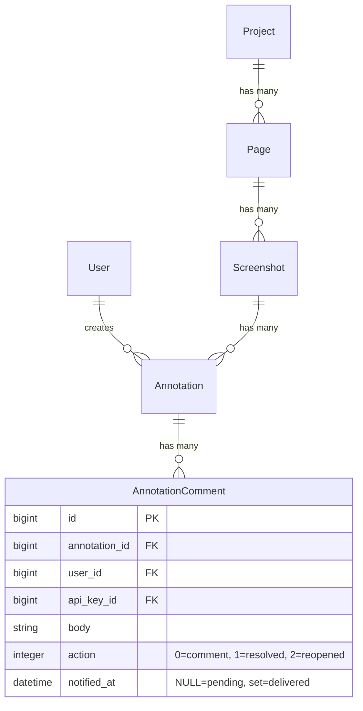

# feat: Answer Feedback with Digest Notifications

## Overview

Currently, when Claude retrieves annotations from Screenote, it can only mark them as "resolved." This plan adds two capabilities:

1. **Answer feedback** — Claude leaves an explanatory reply comment before resolving each annotation, so the reviewer knows what was fixed
2. **Digest notifications** — Annotation authors receive a single hourly email summarizing all resolutions, instead of per-annotation spam

The feature spans two repos:
- **claude-screenote** (this repo) — SKILL.md changes for comment-before-resolve behavior
- **screenote** (the Rails app) — new column, mailer, and background job for digest notifications

## Problem Statement

Reviewers leave visual annotations on screenshots. Claude fixes the issues and marks them resolved, but:
- The reviewer has **no explanation** of what was changed — they must open the code to verify
- The reviewer has **no notification** that their feedback was addressed — they must manually check Screenote

---

## Part 1: Answer Feedback (SKILL.md Change)

### What Changes

Update `skills/screenote/SKILL.md` Step 6 to instruct Claude to always post an explanatory comment before resolving.

### Current Behavior (Step 6)

```markdown
### Step 6: Offer Next Steps
- Address a specific annotation (and mark it resolved via `resolve_annotation` when done)
- Address all annotations one by one
- Take a new screenshot after making fixes
```

### New Behavior (Step 6)

Replace Step 6 with a detailed "Fix and Respond" workflow:

```markdown
### Step 6: Fix and Respond

After presenting annotations, ask the user what to do. Then for each annotation being addressed:

1. **Fix the code** (if a code change is needed)
2. **Post a reply comment** explaining what was done:
   - Call `add_annotation_comment` with `annotation_id` and a `body` describing the fix
   - Comment format: describe what was changed and where (file:line)
   - For "won't fix" / "by design" cases, explain the reasoning instead
3. **Resolve the annotation**:
   - Call `resolve_annotation` with a brief `comment` (e.g., "Fixed" or "Won't fix — see reply")
4. **If `add_annotation_comment` fails**, warn the developer but proceed with `resolve_annotation` anyway

Offer these options:
- Fix a specific annotation (and comment + resolve when done)
- Fix all annotations one by one (comment + resolve each)
- Reply without fixing (leave a comment explaining why, then resolve)
- Take a new screenshot after making fixes (`/screenote <url>`)
```

### Key Design Decisions

**Q: Why call both `add_annotation_comment` AND `resolve_annotation` instead of just using `resolve_annotation`'s `comment` param?**

They serve different purposes:
- `add_annotation_comment` → creates a visible **reply** in the annotation thread (action: `comment`). This is what the reviewer reads.
- `resolve_annotation` `comment` param → creates a **resolution note** (action: `resolved`). This is the audit trail entry.

**Q: What should the comment say?**

Template:
```
Fixed: [one-line summary]
Changed: [file:line] — [what was changed]
```

For non-code resolutions:
```
Won't fix: [reason]
```

**Q: What if the MCP call fails?**

If `add_annotation_comment` fails → warn developer, proceed to resolve anyway.
If `resolve_annotation` fails → report the error, do not retry silently.

### Files to Change

| File | Change |
|---|---|
| `skills/screenote/SKILL.md:172-178` | Replace Step 6 with new "Fix and Respond" workflow |

---

## Part 2: Digest Notifications (Screenote Rails App)

### Architecture

No new models. A single `notified_at` column on `annotation_comments` tracks which resolutions have been emailed. A SolidQueue recurring job queries unnotified resolutions and sends digest emails.

```
Annotation resolved (any source: MCP tool OR web UI)
  → AnnotationComment created with action: :resolved
  → notified_at is NULL by default

SolidQueue job (every 60 min, production only)
  → Query: AnnotationComment.where(action: :resolved, notified_at: nil)
  → Filter out self-resolutions (resolver == annotation author)
  → Filter out authors without email
  → Group by annotation author
  → Send one digest email per author
  → UPDATE notified_at for sent comments
```

### Migration

```ruby
# db/migrate/XXXXXX_add_notified_at_to_annotation_comments.rb
class AddNotifiedAtToAnnotationComments < ActiveRecord::Migration[8.1]
  def change
    add_column :annotation_comments, :notified_at, :datetime

    # Mark all existing resolved comments as already notified to prevent retroactive spam
    reversible do |dir|
      dir.up do
        execute "UPDATE annotation_comments SET notified_at = CURRENT_TIMESTAMP WHERE action = 1"
      end
    end
  end
end
```

### Background Job

```ruby
# app/jobs/send_digest_notifications_job.rb
class SendDigestNotificationsJob < ApplicationJob
  queue_as :default

  def perform
    unnotified_resolutions
      .group_by { |c| c.annotation.user }
      .each do |author, comments|
        next if author.nil? || author.email.blank?

        # Filter out self-resolutions
        # ApiKey belongs_to :project (no user association), so API resolutions
        # cannot be identified as self-review — they always notify.
        non_self = comments.reject { |c| c.user.present? && c.user == author }
        next if non_self.empty?

        send_digest(author, non_self)
      end
  end

  private

  def unnotified_resolutions
    AnnotationComment
      .where(action: :resolved, notified_at: nil)
      .includes(annotation: [:user, { screenshot: { page: :project } }])
  end

  def send_digest(recipient, comments)
    # Mark as notified BEFORE sending to guarantee at-most-once delivery.
    # If deliver_now later fails, we accept the dropped email rather than risk
    # sending duplicates on the next job run. Resolutions remain visible in the UI.
    AnnotationComment.where(id: comments.map(&:id)).update_all(notified_at: Time.current)
    NotificationMailer.resolution_digest(recipient, comments).deliver_now
  rescue => e
    Rails.logger.error("Digest notification failed for user #{recipient.id}: #{e.message}")
    # notified_at is already set; email is dropped, not retried.
  end
end
```

### SolidQueue Recurring Schedule

Add under existing `production:` key in `config/recurring.yml`:

```yaml
production:
  clear_solid_queue_finished_jobs:
    command: "SolidQueue::Job.clear_finished_in_batches(sleep_between_batches: 0.3)"
    schedule: every hour at minute 12

  send_digest_notifications:
    class: SendDigestNotificationsJob
    schedule: every hour at minute 0
```

### Mailer

```ruby
# app/mailers/notification_mailer.rb
class NotificationMailer < ApplicationMailer
  def resolution_digest(recipient, comments)
    @recipient = recipient
    @grouped = prepare_grouped_comments(comments)

    mail(
      to: recipient.email,
      subject: subject_line(comments)
    )
  end

  private

  def subject_line(comments)
    count = comments.size
    projects = comments.map { |c| c.annotation.screenshot.page.project.name }.uniq
    project_label = projects.size == 1 ? projects.first : "#{projects.size} projects"
    "[Screenote] #{count} annotation#{'s' if count > 1} resolved in #{project_label}"
  end

  def prepare_grouped_comments(comments)
    comments.group_by { |c| c.annotation.screenshot }.map do |screenshot, screenshot_comments|
      {
        page_name: screenshot.page.name,
        screenshot_title: screenshot.title,
        items: screenshot_comments.map { |c| build_item(c) }
      }
    end
  end

  def build_item(resolution_comment)
    # Find the most recent reply comment posted before or at the same time as the resolution
    reply = resolution_comment.annotation.annotation_comments
      .where(action: :comment)
      .where("created_at <= ?", resolution_comment.created_at)
      .order(created_at: :desc)
      .first

    {
      annotation_text: resolution_comment.annotation.comment,
      reply_text: reply&.body,
      resolver: resolution_comment.user&.email || "API"
    }
  end
end
```

### Email Template

```erb
<%# app/views/notification_mailer/resolution_digest.html.erb %>

<h2>Feedback resolved in your project</h2>

<p>Hi <%= @recipient.email %>,</p>

<% @grouped.each do |group| %>
  <h3><%= group[:page_name] %> — <%= group[:screenshot_title] %></h3>

  <% group[:items].each do |item| %>
    <table cellpadding="0" cellspacing="0" border="0" width="100%">
      <tr>
        <td width="3" bgcolor="#4A90D9"></td>
        <td style="padding-left: 12px; padding-bottom: 16px;">
          <p><strong>Your annotation:</strong> <%= truncate(item[:annotation_text], length: 200) %></p>
          <% if item[:reply_text] %>
            <p><strong>Reply:</strong> <%= truncate(item[:reply_text], length: 500) %></p>
          <% end %>
          <p><strong>Resolved by:</strong> <%= item[:resolver] %></p>
        </td>
      </tr>
    </table>
  <% end %>
<% end %>

<p>
  <a href="<%= root_url %>">View in Screenote</a>
</p>
```

Note: Email templates require inline styles for cross-client compatibility (intentional exception to the project's "no inline styles" rule). Using table-based layout for maximum email client support.

### Files to Create/Change (Screenote Rails App)

| File | Action | Description |
|---|---|---|
| `db/migrate/XXXXXX_add_notified_at_to_annotation_comments.rb` | Create | Add column + backfill existing |
| `app/jobs/send_digest_notifications_job.rb` | Create | Hourly job to send digest emails |
| `config/recurring.yml` | Edit | Add job under `production:` key |
| `app/mailers/notification_mailer.rb` | Create | Digest mailer with data preparation |
| `app/views/notification_mailer/resolution_digest.html.erb` | Create | Email template (render only, no queries) |
| `test/jobs/send_digest_notifications_job_test.rb` | Create | Job tests |
| `test/mailers/notification_mailer_test.rb` | Create | Mailer tests |

---

## Edge Cases Handled

| Case | Behavior |
|---|---|
| Self-review (resolver == annotation author) | Filtered out in job, no email |
| API key resolution (no user on ApiKey) | Cannot determine resolver identity — always notifies |
| Author has no email | Skipped in job |
| Job fails before marking notified | Comments keep `notified_at: nil`, retried next run |
| Deliver fails after marking notified | Email is dropped (at-most-once); resolutions remain visible in the UI |
| First deploy with existing data | Migration backfills `notified_at` on all existing resolved comments |
| Manual resolution via web UI | Same `AnnotationComment` with `action: resolved` is created, job picks it up |
| Multiple authors on same screenshot | Each author gets their own digest |
| Zero resolutions in an hour | Job runs, finds nothing, exits cleanly |
| Comments span multiple projects | Subject line shows project count |

---

## Acceptance Criteria

### Part 1: Answer Feedback
- [ ] Claude posts a reply comment (via `add_annotation_comment`) before resolving any annotation
- [ ] Reply comment describes what was changed (file, line, summary) or why it won't be fixed
- [ ] `resolve_annotation` is called after the comment is posted
- [ ] If comment posting fails, Claude warns the developer and resolves anyway
- [ ] "Reply without fixing" option available for won't-fix cases

### Part 2: Digest Notifications
- [ ] `notified_at` column added to `annotation_comments`
- [ ] `SendDigestNotificationsJob` runs every 60 minutes via SolidQueue (production only)
- [ ] Job groups unnotified resolved comments by annotation author
- [ ] Self-resolutions (resolver == author) are filtered out
- [ ] One digest email per author per run
- [ ] Email lists resolved annotations grouped by screenshot/page
- [ ] Email includes the reviewer's original annotation text and Claude's reply
- [ ] `notified_at` set before `deliver_now` to guarantee at-most-once delivery
- [ ] Deliver failures are logged and dropped (no duplicate emails on retry)
- [ ] First deploy does not spam existing users (migration backfills `notified_at`)
- [ ] No queries in email template — all data prepared in mailer

---

## ERD



---

## Implementation Order

1. **SKILL.md update** (this repo) — no dependencies, can ship immediately
2. **Migration** (screenote) — add `notified_at` column + backfill
3. **Mailer + template** (screenote) — the email itself
4. **Background job + schedule** (screenote) — starts delivering
5. **Tests** (screenote) — job and mailer tests
